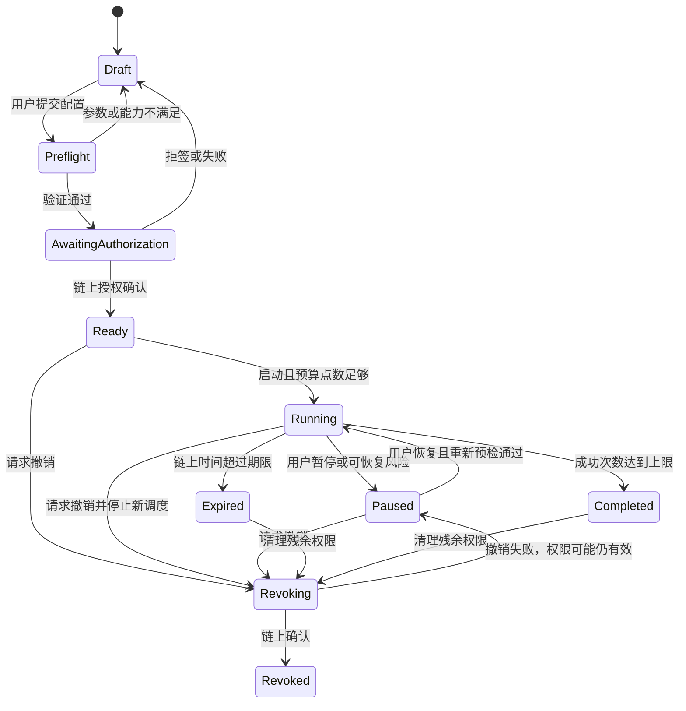

# 状态机、数据模型与接口约定
版本 0.1 · 应与 PRD 的 BR01–BR22 一起实现。以下接口名为内部设计，不是声称目标合约已提供的 ABI。

## 状态机
策略与交易、权限与点数独立建模，避免一个“运行中”遮盖不同事实。

账户连接状态：Disconnected / Connecting / Connected / WrongChain / Unsupported。只影响交互；后台既有策略能否执行取决于链上权限，而非网页连接状态。钱包切换立即清理当前账户私有视图，不自动修改旧策略。

权限状态：None / Pending / Active / Expired / Revoking / Revoked / Unknown。只有确认 Active 且范围精确匹配策略才可新执行；Unknown 必须停止新增广播。Completed 不等于 Revoked。

单个执行机会：
Scheduled → Preflight → Reserved → Broadcast → Included → Confirmed。
Preflight 可到 Skipped；Reserved 在确定未广播且失败时到 Failed 并释放预留；Broadcast 在 RPC 超时到 Unknown，不能释放。
Included 若 receipt status=0，确认后 Failed（Gas 计账，服务点退预留）；status=1 仍需校验预期业务事件/状态后 Confirmed。
替换交易记录 Replaced 及 replacementOf；同一逻辑执行最多一个最终成功。Included/Confirmed 因重组到 Reorged → Reconciling，再按 canonical receipt 重建；已记账项以冲正处理。
取消/加速交易只改变同 nonce 交易链，不新建计费执行。取消广播不保证成功；平台不代替用户做未授权资金操作。

点数订单：Created → AwaitingPayment → Seen → Confirming → Credited。过期未付到 Expired；晚到正确支付进入 Review，不静默吞款。退款：Requested → Reserved → RefundSubmitted → RefundConfirmed；未知保留锁定；失败经对账后释放。入账与退款重组到 Reconciling，未解决前暂停受影响账户新扣点。

奖励：Projected（当前矿块）→ Claimable（矿块封闭、链上证实）→ ClaimSubmitted → Claimed（确认）；失败返回 Claimable；没有可靠读数用 Unknown；重组回退，不能再记一笔奖励收入。

## 调度不变量与并发
数据库锁键 = (chainId, executionAccount, protocolId, miningBlockIndex)，MVP 同账户同协议唯一活动策略。队列是至少一次投递，不能把队列“仅消费一次”当安全依据。
执行合约同时维护对应矿块的消费标记和累计预算；读后写放在同一原子交易内。仅数据库锁不足以限制被攻破 keeper。
执行前预留本次最大本金、费用与 1 点；链上执行时再次检查策略版本、期限、矿块窗口、白名单、minOut、累计上限。平台提交时的报价不能替代合约端边界。
成功后以实际本金/Gas/协议事件结算，释放未用预留；手续费退款从实际余额差与事件对账，不假设所有未用 value 都返还。nonce 管理按实际交易发送账户串行，平台 keeper 的 nonce 与用户智能账户的操作 nonce 分开。
成功次数到上限终止；失败/跳过不消耗成功次数，仍受期限和 Gas 总预算限制。重启先恢复 Unknown/在途交易，再调度新机会；禁止补跑历史窗口。

## 数据字典
所有表含 id、createdAt、updatedAt；链上数值以十进制整数字符串/数据库 NUMERIC(78,0) 存储。API 禁止浮点金额；时间使用 UTC，链上时间为判定依据。地址规范化存储，展示 checksum；金额附 Token 地址、chainId、decimals。

| 实体 | 核心字段 | 唯一键/关系及来源 |
|---|---|---|
| ProtocolDeployment | protocolId, environment, chainId, token, hook, router, poolKey, deploymentBlock, abiHash, codeHashes, genesis, blockSeconds, verifiedAt, verificationEvidence, enabled | (protocolId, chainId, version)；证据通过才 enabled |
| WalletIdentity | ownerAddress, authNonceHash, expiresAt | 身份挑战 nonce 一次性；不存私钥 |
| ExecutionAccount | ownerAddress, chainId, accountAddress, implementationHash, deploymentTx | (chainId, accountAddress)；属于钱包 |
| Authorization | accountId, strategyVersion, policyHash, allowedTargets/actions, recipients, assets, caps, validAfter/Until, nonce, status, grantTx, revokeTx | (chainId, accountId, nonce)；链为权限真相 |
| Strategy | owner, accountId, protocolVersion, authorizationId, version, amountPerRun, principalCap, gasCap, serviceFeeCap, maxSuccesses, offsetSeconds, windowSeconds, minInterval, slippageBps, expiresAt, status, pauseReason | 账户活动策略约束；金额为最小单位 |
| Execution | strategyId, miningBlockIndex, opportunityId, status, reasonCode, reservationId, amountActual, serviceUnits, quoteId | 全局机会锁；一策略有多执行 |
| TransactionAttempt | executionId, sender, nonce, txHash, userOpHash, replacementOf, status, receiptStatus, blockHash/Number, gasUsed, effectiveGasPrice, chainSpecificFee | hash 唯一；一执行可有多个尝试但一次结算 |
| QuoteSnapshot | deploymentVersion, blockHash/Number, amountIn, expectedOut, minOut, feeBreakdown, expiresAt, source | 不可变；与执行关联 |
| MiningBlock | protocolVersion, index, start/end, scheduledReward, targetWork, totalWork, canonicalStatus | (protocolVersion,index) |
| WorkRecord | miner, blockIndex, executionId?, amountWork, eventId | 以链上证据归属，允许站外操作 |
| RewardRecord | miner, blockIndex/range, projected, claimable, claimed, claimTx, eventId | 与代币买入收益独立；不得因领取双记 |
| PackageVersion | paymentToken, units, price, decimals, refundTermsVersion, active | 不修改历史售价 |
| PurchaseOrder | wallet, chainId, packageVersion, units, expectedAmount, payer, beneficiary, status, expiresAt, paymentEventId | orderId 全局唯一；订单版本不可变 |
| CreditLedger | wallet, orderId?, executionId?, type, units, amount, reversesEntryId?, evidenceId | append-only；事件+业务类型唯一；类型 grant/reserve/consume/release/refund/reversal |
| Refund | orderId, units, amount, recipient, status, txHash, idempotencyKey | 只退可用已购点数，关联冻结流水 |
| ChainEvent | chainId, blockNumber/hash, txHash, logIndex, decodedType, payload, canonical | (chainId,blockHash,txHash,logIndex) |
| IndexerCursor | chainId, contractSetVersion, blockNumber/hash, finalityLevel | 哈希分叉回退重放 |
| AuditEvent | actor, action, objectId, beforeHash, afterHash, correlationId | 权限变更/调度/账务审计；不写凭据或私钥 |

点数可用余额 = 累计授予 − 累计已消费 − 当前预留 − 已退次数（全部含冲正净额）；不允许负余额继续调度。若已消费支付遭深重组造成短缺，记录债务并冻结新执行，不抹除历史或取用户其他资产。
购买金额是预付服务款，不全额当日计为挖矿成本；按实际消费次数分摊套餐成本，FIFO 分配订单，最后一次处理舍入余量。退款仅减少未消费预付余额。

## 服务边界及 API 草案
- 协议 Adapter：getDeployment/getSnapshot/quoteBuy/simulateBuy/buildBuy/getWork/getRewards/buildClaim。read 与 build 分开；未知 ABI 不构造 calldata。
- GET /protocols/{id}/snapshot：公开，返回值、区块哈希、读取时间、freshness、finality、错误项。
- POST /auth/challenge、/auth/verify：挑战域/链/地址/nonce/到期校验；会话 cookie 安全属性与 CSRF 防护。
- POST /strategies：签名所有者的草稿；POST /strategies/{id}/activate|pause|resume；权限扩大创建新版本。
- GET /strategies/{id}/executions、/authorizations、/rewards：必须验证资源归属；chainId 隔离。
- POST /orders、GET /orders/{id}、POST /refunds：幂等键+请求体摘要，不同 payload 重用 key 返回冲突。
- GET /ledger、/history/export：用户自有记录；导出防公式注入。
- 链上确认才更新 authorization/credit/reward 终态；客户端 txHash 只是待核实线索，不是成功证明。
- 统一错误：WRONG_CHAIN、CONFIG_UNVERIFIED、STALE_DATA、CAPABILITY_UNSUPPORTED、AUTH_EXPIRED、BUDGET_LOW、CREDIT_LOW、WINDOW_MISSED、SLIPPAGE_HIGH、GAS_HIGH、TX_UNKNOWN、REORG、OWNER_MISMATCH。错误带可重试标志和建议动作。

## 安全与恢复
RPC 至少两个独立来源用于关键一致性检查；不同区块正常滞后与同高度不同哈希分叉区别处理。L2 Included 不等于 L1 最终性；目标链 finality 规则在接入清单中明确，前端展示级别。结算确认深度不能拍脑袋写死。
日志/监控脱敏；服务端仅保存平台 keeper 的受管运行凭据，不接受用户私钥。访问控制、备份恢复、账本重放、keeper 停服后用户退出、合约升级权限（如有）均进入验收。平台可停新执行但不得阻断链上用户退出。合约如可升级，必须公开权力边界与延时，不能宣传管理员无法影响资金。
